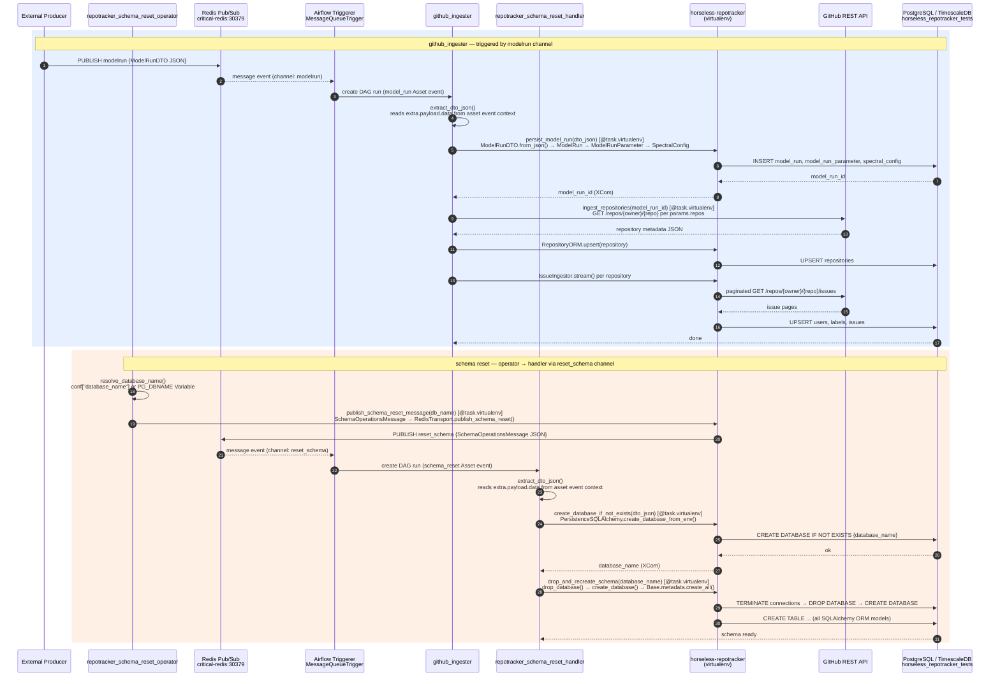

# DAG Architecture — horseless-airflow-dags

> **Living document.** Update this file whenever connections, channels, or DAG task chains change in deployment.

## Deployment context (as of 2026-02-25)

| Component | Value |
|---|---|
| Airflow version | 3.1.7 |
| API server | `http://airflow-api.dubridge.ataxlab.com` (`/api/v2`) |
| Redis broker | `critical-redis.dubridge.ataxlab.com:30379` (db 0) |
| Redis `modelrun` subscribers | 1 (Airflow triggerer) |
| Redis `reset_schema` subscribers | 1 (Airflow triggerer) |
| PostgreSQL | `timescale.dubridge.ataxlab.com:32432` |
| Target database | `horseless_repotracker_tests` |
| Airflow connection (Redis) | `critical_redis` (`login=default`) |
| Airflow connection (PG) | `timescaledb` |

---

## DAGs in scope

| DAG | Trigger | Purpose |
|---|---|---|
| `repotracker_schema_reset_operator` | Manual (`schedule=None`) | Publishes a `SchemaOperationsMessage` to trigger a destructive schema reset |
| `repotracker_schema_reset_handler` | `schema_reset` Asset (Redis pub/sub `reset_schema` channel) | Drops and re-creates the target PostgreSQL database schema |
| `github_ingester` | `model_run` Asset (Redis pub/sub `modelrun` channel) | Persists a `ModelRunDTO` and streams GitHub issues into PostgreSQL |

---

## Interaction diagram

---

## PostgreSQL schema summary

### Regular tables (ORM-managed)

| Table | Notes |
|---|---|
| `model_run` | Top-level run record; `status`, `started_at` |
| `model_run_parameter` | Repos, dates, keyword, token — 1:1 with `model_run` |
| `spectral_config` | Nyquist sampling config — 1:1 with `model_run_parameter` |
| `repositories` | GitHub repo metadata; upserted per run |
| `users` | GitHub user records |
| `issues` | GitHub issues |
| `labels` | Issue labels |
| `issue_labels` | M:N join |
| `issue_comments` | Issue comment bodies |
| `pull_requests` | PR metadata |
| `commits`, `commit_comments` | Commit data |
| `milestones`, `organizations`, `teams` | Metadata |
| `reactions`, `review_requests`, `pr_reviews`, `pr_review_comments` | PR review data |
| `deployments`, `licenses` | Repository metadata |
| `model_assets`, `model_logs`, `model_run_actions`, `model_run_actors`, `model_run_events`, `model_run_triggers` | Run lifecycle tracking |

### TimescaleDB hypertables (time-partitioned, 1 dimension each)

| Hypertable | Compression |
|---|---|
| `github_repository_events` | off |
| `issue_timeline_comment_events` | off |
| `issue_timeline_commit_events` | off |
| `issue_timeline_connected_events` | off |
| `issue_timeline_cross_reference_events` | off |
| `issue_timeline_project_events` | off |
| `issue_timeline_ref_push_events` | off |
| `issue_timeline_rename_events` | off |
| `issue_timeline_review_events` | off |
| `issue_timeline_reviewed_events` | off |
| `issue_timeline_state_events` | off |
| `issue_timeline_transferred_events` | off |

---

## Airflow connection registry

| `conn_id` | Type | Host | Port | Login | Used by |
|---|---|---|---|---|---|
| `critical_redis` | redis | `critical-redis.dubridge.ataxlab.com` | 30379 | `default` | `MessageQueueTrigger` in `github_ingester`, `repotracker_schema_reset_handler` |
| `schema_redis` | redis | `critical-redis.dubridge.ataxlab.com` | 30379 | `default` | reserved |
| `timescaledb` | postgres | `timescale.dubridge.ataxlab.com` | 32432 | `postgres` | direct PG tooling |

## Airflow Variables — Redis transport (resolved at DAG parse time)

| Variable | Live value | Consumer |
|---|---|---|
| `REDIS_PUBSUB_HOST` | `critical-redis.dubridge.ataxlab.com` | `RedisTransport` in virtualenv tasks |
| `REDIS_PUBSUB_PORT` | `30379` | `RedisTransport` |
| `REDIS_PUBLISH_USERNAME` | `default` | `RedisTransport` |
| `REDIS_PUBLISH_PASSWORD` | `(secret)` | `RedisTransport` |
| `REDIS_PUBSUB_MODELRUN_CHANNEL` | `modelrun` | `github_ingester` trigger |
| `REDIS_PUBSUB_SCHEMAOPS_RESET_CHANNEL` | `reset_schema` | `repotracker_schema_reset_handler` trigger |
